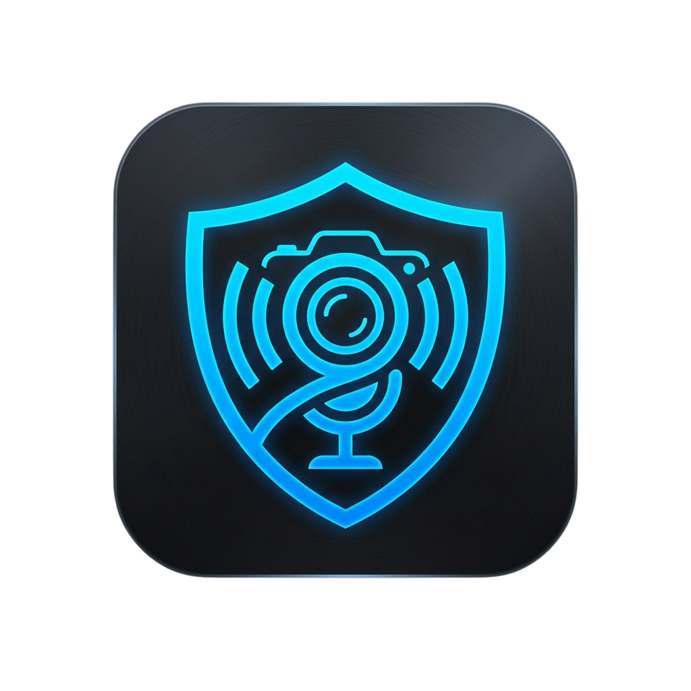
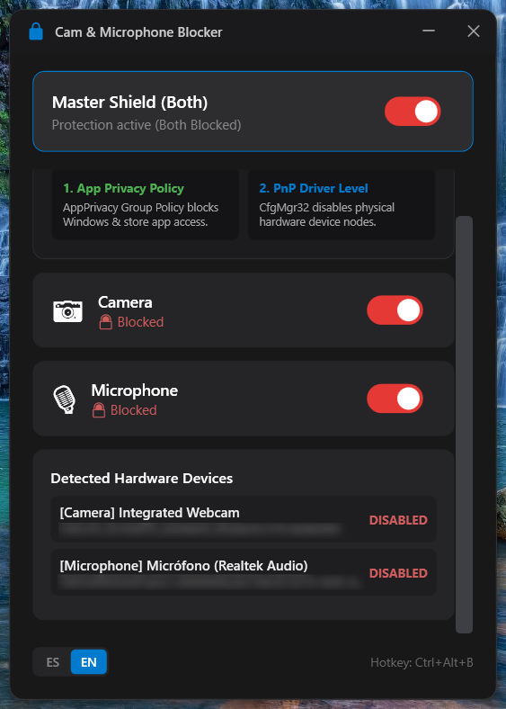
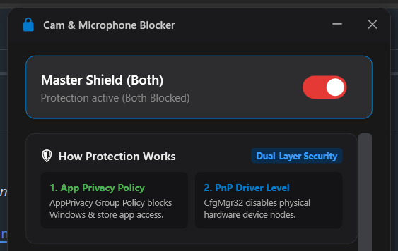
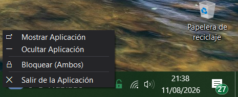

<p align="center">
  
  <h1 align="center">PrivLock — Camera &amp; Microphone Blocker</h1>
</p>

<p align="center">
  
  
  
  
  
</p>

**PrivLock** is a native desktop application designed primarily for Windows (C# / .NET 10 / WPF), created to **quickly, reliably, and 100% reversibly block and unblock access to the camera and microphone**.

---

## 📦 Direct Downloads & Assets (Releases)

<div align="center">

| Resource / Asset | Description | Direct Download (GitHub Assets) |
| :--- | :--- | :---: |
| 💻 **PrivLock Setup** | Single-elevation Windows installer (`.exe`) | [](https://github.com/cristianbarreiro/CamAndMicroBlocker/releases/download/v.1.0.0/PrivLock-Setup-1.0.0.exe) |
| ⚡ **PrivLock Portable** | Ready-to-use portable compressed package (`.zip`) | [](https://github.com/cristianbarreiro/CamAndMicroBlocker/releases/download/v.1.0.0/PrivLock-Portable-1.0.0.zip) |

<br />

> 📌 **View all releases and assets on GitHub Releases**:  
> 👉 **[Go to version v1.0.0 on GitHub Releases](https://github.com/cristianbarreiro/CamAndMicroBlocker/releases/tag/v.1.0.0)**

</div>

---

## 📸 Screenshots & Preview

<p align="center">
  <!-- SCREENSHOT PLACEHOLDER 1: Main Window -->
  
  <br />
  <sub><b>Figure 1:</b> Main Window with Fluent Dark Theme, integrated title bar, and language selector.</sub>
</p>

<br />

<div align="center">
  <table>
    <tr>
      <td align="center">
        <!-- SCREENSHOT PLACEHOLDER 2: How It Works Section -->
        
        <br />
        <sub><b>Figure 2:</b> Dual-Layer Protection Overview</sub>
      </td>
      <td align="center">
        <!-- SCREENSHOT PLACEHOLDER 3: Tray Menu -->
        
        <br />
        <sub><b>Figure 3:</b> System Tray Menu</sub>
      </td>
    </tr>
  </table>
</div>

---

## ✨ Key Features

- 🛡️ **Dual-Layer Protection (Dual-Layer Security)**:
  1. **Layer 1 (System Policies)**: Applies group policies in `HKLM\SOFTWARE\Policies\Microsoft\Windows\AppPrivacy` to block access for Windows and Store applications.
  2. **Layer 2 (PnP Hardware Controller)**: Executes native `CfgMgr32.dll` calls (`CM_Disable_DevNode` / `CM_Enable_DevNode`) to disable device nodes at the system level.
- ⚡ **Zero UAC Fatigue (Single-Elevation Model)**:
  - Prompts for administrator permissions **only once upon startup** (`requireAdministrator`).
  - All subsequent toggles (keyboard shortcut, system tray menu, or UI switches) execute **instantly (0 ms IPC latency) without prompting UAC again**.
- 🎨 **Modern Fluent Dark UI Design**:
  - Integrated header (*Custom Title Bar*) 38px high with rounded corners (12px) and drop shadow.
  - Custom ultra-thin 8px scrollbar (*Custom ScrollBar*).
- 🌐 **Dynamic Multilingual Support (ES / EN)**:
  - Segmented pill selector `[ ES | EN ]` in the window footer.
  - Instant real-time language switching without restarting the app.
- ⌨️ **Global Keyboard Shortcut**: Toggle instant blocking using **`Ctrl + Alt + B`**.
- 📌 **System Tray Integration**:
  - Silently minimizes to the tray when closing `(X)`.
  - In-memory dynamic icons (Green Lock = Allowed, Red Lock = Blocked).

---

## 🛠️ System Requirements

- **Operating System**: Windows 10 or Windows 11 (64-bit).
- **Runtime**: [.NET 10 Desktop Runtime](https://dotnet.microsoft.com/download/dotnet/10.0) (or run the *Self-Contained* portable build).
- **Privileges**: Requires Administrator rights (automatically requested via UAC on startup).

---

## 🚀 Installation & Usage

### Option 1: Windows Installer (Recommended)
1. Download the `PrivLock-Setup-1.0.0.exe` installer from the Releases section.
2. Run the installer and follow the on-screen instructions.

### Option 2: Portable Executable
1. Download the portable executable `PrivLock.exe` from the Releases section.
2. Double-click `PrivLock.exe`.
3. Accept the UAC prompt (Administrator) **once**.
4. All set! The main window will open and the icon will appear in the system tray near the clock.

---

## 💻 Building from Source

If you want to build the project manually using the .NET 10 SDK:

```powershell
# 1. Clone the repository
git clone https://github.com/cristianbarreiro/CamAndMicroBlocker.git
cd CamAndMicroBlocker

# 2. Restore and build the solution
dotnet build CamMicBlocker.sln

# 3. Run unit tests (26 tests)
dotnet test CamMicBlocker.sln

# 4. Publish the single-file portable executable (Single-File)
dotnet publish src/CamMicBlocker/CamMicBlocker.csproj -c Release -r win-x64 --self-contained -p:PublishSingleFile=true -o publish_out
```

The distribution-ready executable will be generated in the `publish_out\PrivLock.exe` folder.

---

## 📐 Code Architecture

The project follows a clean layered architecture based on **DDD (Domain-Driven Design)**:

```text
Cam&MicroBlocker/
├── src/
│   └── CamMicBlocker/
│       ├── App.xaml / App.xaml.cs    # Application startup and 8-step bootstrapper logging
│       ├── Application/              # Orchestration Services (BlockingService, LanguageService)
│       ├── Domain/                   # Pure Domain Models and Interfaces (IDeviceDetector, IDeviceController)
│       ├── Infrastructure/           # CfgMgr32 P/Invoke, HKLM Registry, WMI DeviceDetector
│       ├── Logging/                  # Serilog + CrashReporter (JSON post-mortem dumps)
│       └── UI/                       # WPF Views (MainWindow, NotificationWindow, TrayIcon, Localization)
├── tests/
│   └── CamMicBlocker.Tests/          # xUnit Unit Test Suite
└── AGENTS.md                         # Architecture guide and security rules for AI agents
```

---

## 📄 License

PrivLock is free software released under the **GNU General Public License v3.0 (GPL-3.0)**.

```text
Copyright (C) <YEAR> <COPYRIGHT HOLDER>
Repository: <REPOSITORY_URL>
```

### Key Terms & Conditions under GPL-3.0:
- 🔓 **Freedom to Use & Modify**: You are free to run, study, adapt, modify, and redistribute this software.
- 🔄 **Copyleft Requirement**: Any modified versions or derivative works that are distributed must also be licensed under GNU GPL v3.0, ensuring the software remains free and open source.
- 💼 **Commercial Usage**: Commercial use and distribution are permitted under GPL-3.0 conditions (provided Corresponding Source code is made available to recipients).
- 🛡️ **No Warranty**: PrivLock is provided "as is" without warranty of any kind, explicit or implied.

For complete license terms, legal notices, C# header templates, and third-party dependency disclosures, please see:
- [LICENSE](LICENSE) — Official verbatim text of the GNU General Public License v3.0
- [COPYRIGHT](COPYRIGHT) — Copyright details, recommended source code header template, and third-party notices